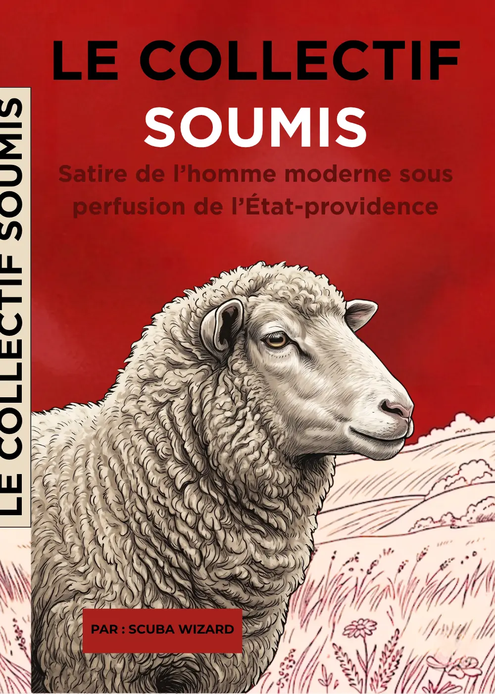

<p align="center">
  
</p>

<h1 align="center">Le Collectif soumis</h1>

<p align="center">
  <strong>Satire de l’homme moderne sous perfusion de l’État-providence.</strong><br>
  Le site officiel du livre de Scuba Wizard.
</p>

<p align="center">
  
  
  
</p>

<p align="center">
  <a href="https://oxscuba.github.io/Le-Collectif-Soumis/">Ouvrir le site</a>
  ·
  <a href="#-le-projet">Le projet</a>
  ·
  <a href="#-développement-local">Développement</a>
</p>

---

> Il n’a pas fallu enchaîner l’homme moderne.  
> Il a suffi de le rassurer.

## 📕 Le projet

**Le Collectif soumis** est une satire politique, économique, philosophique,
anthropologique et littéraire de la servitude confortable.

À travers fables, scènes burlesques, portraits sociaux et dystopies
administratives, le livre observe un homme moderne qui dispose d’outils
d’émancipation sans précédent, mais préfère souvent la permission, la
protection, la validation et l’intermédiaire à la liberté responsable.

Le site transpose cet univers sous la forme d’une procédure administrative :
le visiteur entre dans le guichet, traverse les mécanismes de la dépendance,
rencontre son propre reflet et découvre une issue sans certificat.

## 🎨 Direction artistique

- gravure satirique et fable politique ;
- palette ivoire, bordeaux et noir ;
- formulaires, tampons, portiques et dossiers ;
- progression narrative verticale ;
- Bitcoin comme rupture visuelle, sans promesse de solution magique ;
- adaptation complète aux écrans mobiles.

Toutes les illustrations et tous les textes publiés dans ce dépôt appartiennent
à leur auteur. Leur présence dans un dépôt public n’autorise pas leur
réutilisation, leur reproduction ou leur redistribution.

## 🧭 Parcours

```text
Entrer dans le guichet
        ↓
Demander la permission
        ↓
Recevoir ce qui fut prélevé
        ↓
Habiter une monnaie qui fond
        ↓
Être protégé de soi-même
        ↓
Rencontrer le miroir
        ↓
Sortir du guichet
```

Le site ne reproduit ni le manuscrit ni les documents de l’atelier d’écriture.
Il ne présente qu’une sélection de textes et d’illustrations destinés à la
communication publique du livre.

## 🚀 Développement local

### Prérequis

- Node.js 22 ou plus récent ;
- npm.

### Lancer le site

```bash
npm install
npm run dev
```

Vite affiche l’adresse locale à ouvrir dans le navigateur.

### Vérifier la version de production

```bash
npm run build
npm run preview
```

Le site compilé est créé dans `dist/`.

## 🌐 Déploiement GitHub Pages

Le workflow présent dans `.github/workflows/deploy-pages.yml` construit et
publie automatiquement le site après chaque `push` sur la branche `main`.

Dans les paramètres du dépôt GitHub :

1. ouvrir **Settings** ;
2. ouvrir **Pages** ;
3. dans **Build and deployment**, choisir **GitHub Actions** ;
4. pousser un commit sur `main`.

Le site est ensuite disponible à l’adresse :

```text
https://oxscuba.github.io/Le-Collectif-Soumis/
```

## 🗂️ Architecture

```text
.
├── .github/workflows/        déploiement GitHub Pages
├── public/
│   ├── assets/images/        illustrations optimisées pour le web
│   ├── .nojekyll             compatibilité GitHub Pages
│   ├── favicon.svg
│   └── robots.txt
├── index.html                contenu et structure du site
├── styles.css                identité graphique et responsive
├── script.js                 interactions légères
├── package.json
└── vite.config.ts
```

## 🔒 Confidentialité

Le site :

- ne crée aucun compte ;
- ne contient aucun outil de suivi propriétaire ;
- ne dépose aucun cookie applicatif ;
- ne collecte aucune donnée personnelle ;
- ne contient aucune copie du manuscrit ou du canon privé.

## ⚖️ Droits

Le code source est rendu visible pour permettre le fonctionnement et
l’amélioration du site. Sauf mention contraire explicite, aucun droit de
réutilisation n’est accordé sur les textes, illustrations, personnages, titres
ou éléments graphiques.

---

<p align="center">
  <strong>Le guichet aime les troupeaux bien rangés.<br>
  Une clé peut appartenir à celui qui la garde.<br>
  À vous.</strong>
</p>
